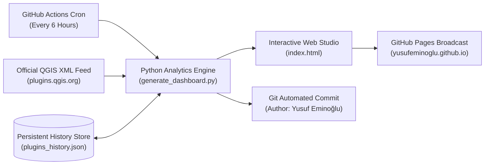

<div align="center">

# QGIS Plugin Portfolio Analytics & Governance Studio
### *Enterprise Telemetry, Quantitative Econometrics & Cyber-Forensic Surveillance Platform*

<br/>

[](https://yusufeminoglu.github.io/qgis-plugins-governance/)
[](https://plugins.qgis.org/plugins/author/Yusuf%20Eminoglu/)

<br/><br/>

[](https://github.com/YusufEminoglu/qgis-plugins-governance/actions)
[](https://yusufeminoglu.github.io/qgis-plugins-governance/)
[](https://plugins.qgis.org/plugins/author/Yusuf%20Eminoglu/)
[](LICENSE)
[](https://github.com/YusufEminoglu)

<br/><br/>

<table>
  <tr>
    <td align="center" style="padding: 24px; border: 1px solid #0284c7; border-radius: 14px; background-color: #0b111e;">
      <h2 style="margin: 0 0 8px 0; letter-spacing: -0.025em; font-family: -apple-system, BlinkMacSystemFont, 'Segoe UI', Roboto, sans-serif;">
        <a href="https://yusufeminoglu.github.io/qgis-plugins-governance/" style="color: #38bdf8; text-decoration: none;">
          ACCESS THE LIVE INTERACTIVE GOVERNANCE STUDIO
        </a>
      </h2>
      <p style="margin: 0 0 14px 0; color: #94a3b8; font-size: 14px; line-height: 1.6;">
        Real-time telemetry, quantitative econometrics, vector choropleth cartography, and cryptographic forensic audit dossiers across 24 production QGIS plugins.
      </p>
      <code><strong><a href="https://yusufeminoglu.github.io/qgis-plugins-governance/" style="color: #0284c7; font-size: 15px; text-decoration: none;">https://yusufeminoglu.github.io/qgis-plugins-governance/</a></strong></code>
    </td>
  </tr>
</table>

</div>

<br/>

## Executive Summary

The **QGIS Plugin Portfolio Analytics & Governance Studio** provides real-time telemetry, quantitative econometrics, macro-regional spatial analysis, and forensic vote-bombing surveillance for the **Yusuf Eminoğlu QGIS Plugin Ecosystem** (24 production plugins spanning urban analytics, spatial statistics, CAD platform engineering, 3D city visualization, and advanced cartography).

The platform continuously queries the official **QGIS.org XML Repository**, synchronizes persistent historical records in [`plugins_history.json`](plugins_history.json), detects inorganic rating anomalies via Shannon entropy analysis, models adoption kinematics ($a = \frac{d^2D}{dt^2}$), and publishes live visual intelligence.

**Direct Live Studio URL:** [https://yusufeminoglu.github.io/qgis-plugins-governance/](https://yusufeminoglu.github.io/qgis-plugins-governance/)

---

## Architectural Pillars & Analytical Modules

### 1. Cyber-Forensic Surveillance & Rating Audit Engine
- **Shannon Influx Entropy ($H$) & Anomaly Score ($EAS$):** Identifies coordinated vote bombing and inorganic volume bursts by evaluating probability distribution shifts across incremental rating votes ($H = -\sum p_i \log_2 p_i$).
- **Implied Influx Rating & Damage Index:** Computes exact score deviations against historical baselines and calculates the organic 5-star volume required to offset malicious submissions.
- **Multi-Channel Forensic Dossier Exporter:** Generates standardized incident evidence packages:
  1. **GitHub Issue Markdown:** Formatted incident dossiers with SHA-256 evidence signatures for QGIS issue trackers.
  2. **QGIS PSC / Hub Admin Memorandum:** Direct **SQL `DELETE` & `UPDATE`** directives for database administrators to restore baseline scores.
  3. **Discord Webhook Payload:** Formatted embed alerts with severity indicators.
  4. **Slack Block Kit:** Enterprise alert message payloads.
  5. **Cryptographic JSON Bundle:** Timestamped raw data packages for external verification.

### 2. Quantitative Econometrics & Adoption Kinematics
- **Sample-Bias Corrected Gini Inequality Coefficient ($G^*$):** Quantifies ecosystem download concentration across the 24 plugins ($G^* = 0.4676$).
- **Herfindahl-Hirschman Index ($HHI$):** Assesses portfolio market diversity and structural resilience ($HHI = 1888$).
- **Empirical Bayes Rating Reliability ($R_{\text{Bayes}}$):** Applies Bayesian shrinkage with a global prior ($m = 5.0$) to balance high-volume tools with newly released plugins.
- **Adoption Acceleration ($a = \frac{d^2D}{dt^2}$):** Second-derivative metric distinguishing high-momentum tools from plateauing releases.
- **Probabilistic Milestone Arrival Horizons:** Multi-scenario Monte Carlo curves with 95% confidence intervals forecasting arrival dates for 100K, 250K, and 500K cumulative downloads.

### 3. Cartographic Intelligence & Spatial Demographics
- **Native Vector SVG World Choropleth:** Zero-dependency interactive map visualizing country-level adoption density with real-time HUD telemetry tooltips.
- **Regional Pan / Zoom Control Matrix:** Interactive transformations focused on Europe, North America, Asia-Pacific, Latin America, and Eastern Europe/Middle East.
- **Suite Geographic Affinity Matrix ($LQ$):** Location Quotient calculations quantifying regional demand across PlanX, Zero2, CAD, and Spatial Stats suites.

### 4. Dual-Theme Design Matrix
- **Obsidian Titanium:** Deep slate space palette with crystalline glassmorphism and subtle ambient lighting.
- **Alabaster Platinum:** High-contrast Swiss editorial light theme meeting strict **WCAG AAA** readability standards.
- **Kinetic Tabular Monospace Counters:** Tabular numerical rollup animations (`animateValue()`) formatted in `JetBrains Mono`.
- **Spotlight Command Palette (<kbd>Ctrl+K</kbd>):** Keyboard-driven fuzzy navigation across all plugins, analytical views, and export tools.

### 5. Executive Storytelling & Communications Suite
- **State of the Ecosystem Report Generator:** Automated executive briefings highlighting quarterly health, risk factors, and strategic growth priorities.
- **Multi-Platform Announcement Kit:** Pre-formatted announcement templates for LinkedIn, X (Twitter), Reddit `r/QGIS`, and GIS StackExchange.
- **Honors & Superlatives Classification:**
  - **Crown Jewel:** Highest cumulative adoption volume.
  - **Speed Demon:** Highest monthly run-rate velocity.
  - **Academic Standard:** Highest Bayesian reliability and rating stability.
  - **Rising Star:** Strongest positive adoption acceleration.

---

## Automated GitOps Telemetry Pipeline



1. **Automated Fetch:** Scheduled GitHub Actions workflows query the live XML feed at `plugins.qgis.org/plugins/plugins.xml`.
2. **Historical Ledger:** New snapshots are committed to [`plugins_history.json`](plugins_history.json) to preserve an immutable historical baseline.
3. **Continuous Broadcast:** Updated static bundles are deployed directly to [GitHub Pages](https://yusufeminoglu.github.io/qgis-plugins-governance/).

---

## Ecosystem Catalog (24 Production Plugins)

| Plugin Name | Category | Primary Focus & Domain | Official QGIS Hub |
|:---|:---|:---|:---:|
| **PlanX** | Urban Analytics | Urban Space Syntax, Centrality, Morphology, OD Matrix, 15-Minute City Studio | [Hub Link](https://plugins.qgis.org/plugins/planx/) |
| **PlanX GeoStats Lab** | Spatial Statistics | Spatial Autocorrelation, Moran's I, LISA, Hotspot (Getis-Ord Gi*), Regression | [Hub Link](https://plugins.qgis.org/plugins/planx_geostats/) |
| **PlanX Suitability Lab** | Spatial Analysis | Raster-based Multi-Criteria Decision Analysis (MCDA), AHP, Suitability Modeling | [Hub Link](https://plugins.qgis.org/plugins/planx_suitability_lab/) |
| **PlanX: Urban Resilience** | Resilience & Hazard | Seismic Vulnerability, Urban Heat Island, Inundation, Social Vulnerability Index | [Hub Link](https://plugins.qgis.org/plugins/planx_urban_resilience/) |
| **PlanX CartoLab** | Cartography | Bivariate Mapping, Cartograms, Value-by-Alpha, Isometric & Ridge Maps | [Hub Link](https://plugins.qgis.org/plugins/planx_cartolab/) |
| **PlanX DataCube Lab** | Spatio-Temporal | Spatio-Temporal Cubes, Emerging Hotspot Analysis (EHSA), Voxel 3D Rendering | [Hub Link](https://plugins.qgis.org/plugins/planx_datacube/) |
| **PlanX 3D City Viewer** | 3D Visualization | Native QGIS to Interactive Three.js WebGL 3D Urban City Exporter | [Hub Link](https://plugins.qgis.org/plugins/planx_3d_city/) |
| **3D OSM Model** | 3D Visualization | Single-click OpenStreetMap to WebGL 3D Urban Fabric Generator | [Hub Link](https://plugins.qgis.org/plugins/osm_3d_model/) |
| **OSM Quick 3D** | 3D Visualization | Native QGIS 3D extruded massing and functional 2D cartography | [Hub Link](https://plugins.qgis.org/plugins/osm_quick_3d/) |
| **PlanX Urban Procedural 3D** | Parametric Design | Procedural Rule-based 3D Urban Zoning & Building Envelope Studio | [Hub Link](https://plugins.qgis.org/plugins/planx_urban_procedural_3d/) |
| **Parametric Process** | Generative Design | Multi-Objective Evolutionary Optimization (NSGA-II, Pareto Front, 3D Cockpit) | [Hub Link](https://plugins.qgis.org/plugins/parametric_process/) |
| **ParcelFlux** | Urban Planning | Urban Block to Parcel Subdivision Generator (Spine offset, frontage control) | [Hub Link](https://plugins.qgis.org/plugins/parcelflux/) |
| **EasyFillet** | CAD Tools | Precision CAD Fillet & Tangent Arc Generator for Vector Geometries | [Hub Link](https://plugins.qgis.org/plugins/EasyFillet/) |
| **PlanX CAD Toolset** | CAD Tools | Professional CAD Drafting, Road Platform Alignment & Survey Tools | [Hub Link](https://plugins.qgis.org/plugins/planX_CAD_arac_Seti/) |
| **PlanX Settlement Toolset** | Urban Planning | Block-to-Parcel Urban Planning Workflow & Zoning Allocation | [Hub Link](https://plugins.qgis.org/plugins/planx_yerlesim_plani_arac_seti/) |
| **PlanX UIP Toolset** | Urban Planning | Statutory Master Planning & Spatial Implementation Tools | [Hub Link](https://plugins.qgis.org/plugins/planx_uip_arac_seti/) |
| **02viz** | Visualization | Multi-Engine (Python/R/HTML) Geospatial Visualization & Chart Studio | [Hub Link](https://plugins.qgis.org/plugins/zero2viz/) |
| **02Multimap** | Mapping Studio | Multi-Panel Synchronized Map Canvases with Laser Pointer Tracking | [Hub Link](https://plugins.qgis.org/plugins/zero2multimap/) |
| **02CadGis** | Data Interoperability | Universal CAD/GIS Converter (DXF, DWG, NCZ, KML/KMZ, DGN, GDB to GPKG) | [Hub Link](https://plugins.qgis.org/plugins/zero2cadgis/) |
| **02truesize** | Map Truth Lab | True-Size Comparative Projection Inspector, Tissot Indicatrix & Size Duel | [Hub Link](https://plugins.qgis.org/plugins/zero2truesize/) |
| **02Urban Portrait** | Generative Art | City as a Face: Reversible Luminance Map Art & Smart Masking Studio | [Hub Link](https://plugins.qgis.org/plugins/zero2urbanportrait/) |
| **02GeoQuest** | Playable GIS | Gamified Map Studio: Find on Map, Value Duel, Distance Guess, Silhouettes | [Hub Link](https://plugins.qgis.org/plugins/zero2geoquest/) |
| **02Agent Smart Modeler** | AI & Workflows | Visual Graphical Modeler with AI Proposals & Micro-Package Presets | [Hub Link](https://plugins.qgis.org/plugins/zero2smartmodeler/) |
| **02Agent OSM Downloader** | Data Acquisition | AI & Command-Assisted Bounded OpenStreetMap Acquisition Engine | [Hub Link](https://plugins.qgis.org/plugins/zero2agent_osm_downloader/) |

---

## Local Execution & Standalone Output

To run the telemetry engine locally:

```powershell
# 1. Direct Python invocation
python generate_dashboard.py

# 2. Automated PowerShell workflow
.\update_dashboard.ps1
```

The generated artifacts (`index.html` and `qgis_plugins_dashboard.html`) are completely self-contained with zero runtime dependencies.

---

## Links & Reference Resources

- **Live Studio Dashboard:** [https://yusufeminoglu.github.io/qgis-plugins-governance/](https://yusufeminoglu.github.io/qgis-plugins-governance/)
- **Source Code Repository:** [https://github.com/YusufEminoglu/qgis-plugins-governance](https://github.com/YusufEminoglu/qgis-plugins-governance)
- **Author Profile on QGIS Hub:** [https://plugins.qgis.org/plugins/author/Yusuf%20Eminoglu/](https://plugins.qgis.org/plugins/author/Yusuf%20Eminoglu/)
- **Author GitHub Profile:** [https://github.com/YusufEminoglu](https://github.com/YusufEminoglu)

---

## License & Attribution

All software, mathematical algorithms, and documentation are authored and maintained by **Yusuf Eminoğlu**.  
Licensed under the [MIT License](LICENSE).
