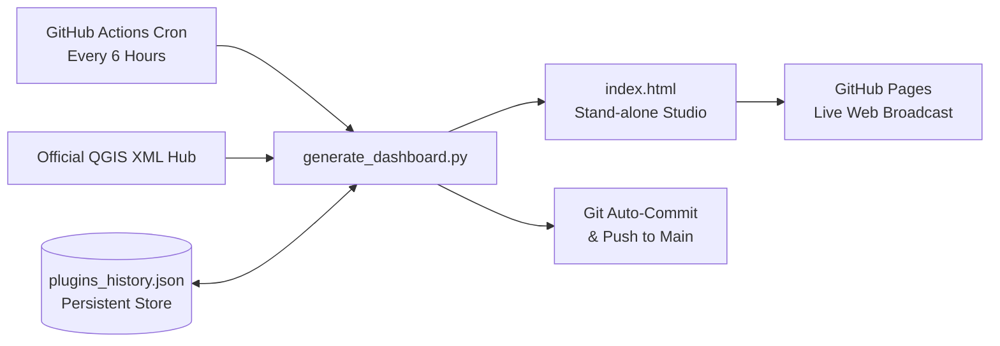

# QGIS Plugin Portfolio Analytics & Rating Governance Studio

[](https://github.com/YusufEminoglu/qgis-plugins-governance/actions/workflows/daily_sync.yml)
[](https://yusufeminoglu.github.io/qgis-plugins-governance/)
[](LICENSE)

An enterprise-grade analytical dashboard, strategic growth simulator, and rating abuse forensic surveillance studio for the **Yusuf Eminoğlu QGIS Plugin Ecosystem** (24 production plugins across urban analytics, spatial statistics, CAD, 3D GIS, and cartography).

---

## 🌟 Key Capabilities

1. **🛡️ Rating Abuse & Vote Bombing Surveillance Center:**
   - Detects abnormal rating drops and volume bursts by calculating $\Delta \text{Votes}$, $\Delta \text{Rating}$, and the exact **Implied Influx Rating** ($\Delta \text{Score} / \Delta \text{Votes}$).
   - Automatically computes the **Rating Damage Index** and fair score recovery targets after rollback.
   - Generates verified mathematical evidence dossiers ready for submission to QGIS Hub infrastructure maintainers (GitHub Markdown, Discord/Slack, and Formal Memo formats).

2. **⏳ Time-Machine Historical Delta Matrix:**
   - Multi-snapshot comparator tracking volume velocity, rating shifts, and adoption trends between any two recorded historical dates.

3. **🎨 Dual Bespoke Luxury Themes:**
   - **Obsidian Titanium:** Deep space dark mode with crystalline glassmorphism and subtle starfield ambient particles.
   - **Alabaster Platinum:** Swiss-inspired high-contrast clean light mode.
   - Instant toggle via header button or <kbd>T</kbd> shortcut with persistent `localStorage` memory.

4. **⚡ Spotlight Command Palette (<kbd>Ctrl+K</kbd>):**
   - Instant fuzzy search to jump across plugins, switch tabs, toggle themes, export data, or launch the comparator in milliseconds.

5. **👑 3-Way Head-to-Head Benchmark Arena:**
   - Side-by-side comparative analysis of 3 plugins across cumulative volume, adoption run-rate, star ratings, and milestone proximity with dynamic winner crown badges.

6. **📈 Multi-Scenario Monte Carlo Adoption Cone:**
   - Strategic forecasting model generating Bullish Acceleration (+45%), Expected Run-Rate, and Conservative Floor (-35%) confidence curves with probability badges toward 100,000 cumulative downloads.

7. **🌍 Macro-Regional & Country Drilldown Inspector:**
   - Continental grouping and interactive country inspector displaying top 5 downloaded plugins per country.

8. **📰 Executive Narrative Briefing Generator:**
   - One-click synthesis of portfolio health, adoption milestones, security anomalies, and market shares for executive reports and release notes.

---

## ⚙️ Architecture & Automated GitOps Workflow

This repository runs on a fully automated, serverless **GitOps telemetry pipeline**:



- **Cron Automation:** `.github/workflows/daily_sync.yml` runs every 6 hours to fetch live XML metadata directly from `plugins.qgis.org`.
- **Immutable Audit Trail:** Any metric shift is committed back to `plugins_history.json`, establishing a cryptographically timestamped audit log of all votes and ratings.
- **Continuous Deployment:** `index.html` is automatically deployed to GitHub Pages.

---

## 🚀 Local Development & Execution

```powershell
# 1. Fetch live metrics and generate dashboard
python generate_dashboard.py

# 2. Or execute via PowerShell sync script
.\update_dashboard.ps1
```

The output file `index.html` (and `qgis_plugins_dashboard.html`) is completely self-contained and operates with zero backend dependencies.

---

## 📜 License & Attribution

Author: **Yusuf Eminoğlu**  
License: [MIT License](LICENSE)  
Official QGIS Hub Profile: [plugins.qgis.org/plugins/author/Yusuf%20Eminoglu/](https://plugins.qgis.org/plugins/author/Yusuf%20Eminoglu/)
