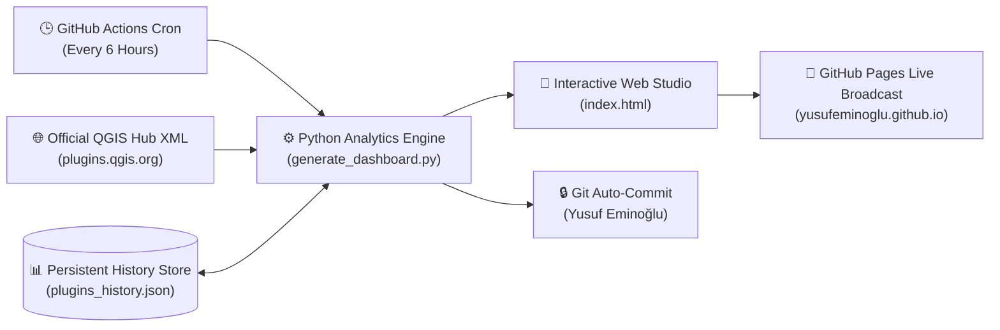

<div align="center">

# 🏛️ QGIS Plugin Portfolio Analytics & Governance Studio
### *Enterprise Executive Decision Cockpit · Quantitative Econometrics · Cartographic Intelligence · Cyber-Forensic Surveillance Center*

<br/>

[](https://yusufeminoglu.github.io/qgis-plugins-governance/)
[](https://yusufeminoglu.github.io/qgis-plugins-governance/)

<br/>

[](https://github.com/YusufEminoglu/qgis-plugins-governance/actions/workflows/daily_sync.yml)
[](https://yusufeminoglu.github.io/qgis-plugins-governance/)
[](https://plugins.qgis.org/plugins/author/Yusuf%20Eminoglu/)
[](LICENSE)
[](https://github.com/YusufEminoglu)

<br/>

---

### 🌟 🌐 **CANLI İNTERAKTİF GOVERNANCE STUDIO'YA GİTMEK İÇİN TIKLAYIN** 🌐 🌟
# 👉 [https://yusufeminoglu.github.io/qgis-plugins-governance/](https://yusufeminoglu.github.io/qgis-plugins-governance/) 👈

> **Click the link above or the prominent launch badges to open the full interactive telemetry cockpit directly in your browser.** Real-time analytics, automated vote fraud surveillance, econometric growth projections, and interactive zero-dependency vector SVG choropleth maps across all 24 production QGIS plugins.

---

</div>

<br/>

## 📖 Executive Summary & Overview

The **QGIS Plugin Portfolio Analytics & Rating Governance Studio** is a world-class, enterprise-grade governance platform designed for the **Yusuf Eminoğlu QGIS Plugin Ecosystem** (comprising 24 specialized production plugins across spatial analysis, space syntax, urban resilience, 3D city modeling, CAD platform engineering, raster MCDA, spatio-temporal datacubes, and advanced cartography).

The studio connects directly to the official **QGIS.org XML Repository**, synchronizes persistent historical telemetry in [`plugins_history.json`](plugins_history.json), detects rating anomalies / vote-bombing attacks via mathematical entropy analysis, models portfolio econometrics (Gini inequality, Bayesian ratings, adoption acceleration), and delivers high-impact executive storytelling.

👉 **Launch Live Studio:** [**https://yusufeminoglu.github.io/qgis-plugins-governance/**](https://yusufeminoglu.github.io/qgis-plugins-governance/)

---

## 💎 Key Capabilities & Architectural Pillars

### 1. 🛡️ Forensic Cyber-Security & Rating Abuse Surveillance Engine
- **Shannon Influx Entropy ($H$) & Anomaly Score ($EAS$):** Detects inorganic rating bursts, vote bombing, and bot manipulation by measuring probability distribution shifts in vote increments ($H = -\sum p_i \log_2 p_i$).
- **Implied Influx Rating & Damage Index:** Reconciles baseline scores against live states to compute exact fraudulent score drops and calculates the required organic 5-star votes to recover.
- **5-Channel Forensic Dossier Exporter:** One-click modal generating export packages for:
  1. **GitHub Issue Markdown:** Formatted complaint dossiers with cryptographic evidence signatures.
  2. **Official QGIS PSC / Hub Admin Memorandum:** Direct **SQL `DELETE` & `UPDATE`** directives ready for database administrators to restore baselines.
  3. **Discord Webhook JSON:** Formatted rich embeds with severity indicators.
  4. **Slack Block Kit:** Enterprise alert message payloads.
  5. **Cryptographic Raw JSON Evidence:** Timestamped SHA-256 verifiable incident package.

### 2. 📐 Advanced Quantitative Econometrics & Adoption Modeling
- **Sample-Bias Corrected Gini Inequality Coefficient ($G^*$):** Quantifies ecosystem download concentration vs diversity across all 24 plugins ($G^* = 0.4676$).
- **Herfindahl-Hirschman Index ($HHI$):** Measures market share distribution and portfolio resilience ($HHI = 1888$).
- **Empirical Bayes Rating Reliability ($R_{\text{Bayes}}$):** Bayesian shrinkage formulation with global prior ($m = 5.0$) that fairly balances high-volume plugins with emerging tools.
- **Adoption Acceleration ($a = \frac{d^2D}{dt^2}$):** Second-derivative kinematic metric pinpointing breakout plugins versus plateauing tools.
- **Probabilistic Milestone Arrival Horizons:** Multi-scenario Monte Carlo curves with 95% confidence intervals predicting exact dates for 100K, 250K, and 500K cumulative downloads.

### 3. 🗺️ Zero-Dependency Cartographic Heatmap & Geospatial Intelligence
- **Native Vector SVG World Choropleth:** Zero-dependency, lightweight interactive world map with country-level adoption color grading and live HUD tooltips.
- **Regional Pan / Zoom Controls:** Smooth matrix transform zoom into Europe, North America, Asia-Pacific, Latin America, and Africa.
- **Suite Geographic Affinity Matrix ($LQ$):** Location Quotient analysis evaluating relative demand for PlanX, Zero2, CAD, and Spatial Stats across global macro-regions.

### 4. 🎨 Master Dual-Theme Luxury Design System
- **Obsidian Titanium:** Deep velvet space palette with crystalline glassmorphism (`::before` specular highlight) and ambient starfield particles.
- **Alabaster Platinum:** Editorial Swiss light theme meeting strict **WCAG AAA** contrast requirements.
- **Kinetic Tabular Monospace Counters:** Real-time smooth numerical rolling animations (`animateValue()`) formatted with `JetBrains Mono` and `tnum`.
- **Spotlight Command Palette (<kbd>Ctrl+K</kbd>):** Instant keyboard-driven fuzzy navigation across plugins, tools, comparators, and export modals.

### 5. 📰 Executive Storytelling & Social Media Announcement Kit
- **State of the Ecosystem Report Generator:** Instantly produces quarterly and annual executive briefings with key takeaways, risks, and strategic guidance.
- **Multi-Platform Social Media Kit:** Auto-formats announcements tailored for LinkedIn, X (Twitter) threads, Reddit `r/QGIS`, and GIS StackExchange.
- **Honors & Superlatives Badges:**
  - 👑 **Crown Jewel** (Highest Total Adoption)
  - ⚡ **Speed Demon** (Highest Growth Velocity)
  - 🎓 **Academic Standard** (Highest Rating & Bayesian Confidence)
  - 🚀 **Rising Star** (Strongest Positive Acceleration)

---

## ⚙️ Automated GitOps & Telemetry Architecture

The studio operates on a fully automated, serverless **GitOps pipeline**:



1. **Automated Synchronization:** `.github/workflows/daily_sync.yml` triggers every 6 hours to fetch fresh XML metadata directly from `plugins.qgis.org`.
2. **Cryptographic Historical Store:** Metric snapshots are merged into [`plugins_history.json`](plugins_history.json) to preserve an immutable historical log of all downloads, ratings, and votes.
3. **Continuous Deployment:** `index.html` is compiled and deployed instantaneously to [GitHub Pages](https://yusufeminoglu.github.io/qgis-plugins-governance/).

---

## 📦 The Yusuf Eminoğlu QGIS Plugin Portfolio (24 Plugins)

| Plugin Name | Category | Primary Focus & Domain | Official QGIS Hub |
|:---|:---|:---|:---:|
| **PlanX** | Urban Analytics | Urban Space Syntax, Centrality, Morphology, OD Matrix, 15-Minute City Studio | [Hub Link](https://plugins.qgis.org/plugins/planx/) |
| **PlanX GeoStats Lab** | Spatial Statistics | Spatial Autocorrelation, Moran's I, LISA, Hotspot (Getis-Ord Gi*), Regression | [Hub Link](https://plugins.qgis.org/plugins/planx_geostats/) |
| **PlanX Suitability Lab** | Spatial Analysis | Raster-based Multi-Criteria Decision Analysis (MCDA), AHP, Suitability Modeling | [Hub Link](https://plugins.qgis.org/plugins/planx_suitability_lab/) |
| **PlanX: Urban Resilience** | Resilience & Hazard | Seismic Vulnerability, Urban Heat Island, Inundation, Social Vulnerability Index | [Hub Link](https://plugins.qgis.org/plugins/planx_urban_resilience/) |
| **PlanX CartoLab** | Cartography | Bivariate Mapping, Cartograms, Value-by-Alpha, Isometric & Ridge Maps | [Hub Link](https://plugins.qgis.org/plugins/planx_cartolab/) |
| **PlanX DataCube Lab** | Spatio-Temporal | Spatio-Temporal Cubes, Emerging Hotspot Analysis (EHSA), Voxel 3D Rendering | [Hub Link](https://plugins.qgis.org/plugins/planx_datacube/) |
| **PlanX 3D City Viewer** | 3D Visualization | Native QGIS to Interactive Three.js WebGL 3D Urban City Exporter | [Hub Link](https://plugins.qgis.org/plugins/planx_3d_city/) |
| **3D OSM Model** | 3D Visualization | Single-click OpenStreetMap to WebGL 3D Urban Fabric Generator | [Hub Link](https://plugins.qgis.org/plugins/osm_3d_model/) |
| **OSM Quick 3D** | 3D Visualization | Native QGIS 3D extruded massing and functional 2D cartography | [Hub Link](https://plugins.qgis.org/plugins/osm_quick_3d/) |
| **PlanX Urban Procedural 3D** | Parametric Design | Procedural Rule-based 3D Urban Zoning & Building Envelope Studio | [Hub Link](https://plugins.qgis.org/plugins/planx_urban_procedural_3d/) |
| **Parametric Process** | Generative Design | Multi-Objective Evolutionary Optimization (NSGA-II, Pareto Front, 3D Cockpit) | [Hub Link](https://plugins.qgis.org/plugins/parametric_process/) |
| **ParcelFlux** | Urban Planning | Urban Block to Parcel Subdivision Generator (Spine offset, frontage control) | [Hub Link](https://plugins.qgis.org/plugins/parcelflux/) |
| **EasyFillet** | CAD Tools | Precision CAD Fillet & Tangent Arc Generator for Vector Geometries | [Hub Link](https://plugins.qgis.org/plugins/EasyFillet/) |
| **PlanX CAD Toolset** | CAD Tools | Professional CAD Drafting, Road Platform Alignment & Survey Tools | [Hub Link](https://plugins.qgis.org/plugins/planX_CAD_arac_Seti/) |
| **PlanX Settlement Toolset** | Urban Planning | Block-to-Parcel Urban Planning Workflow & Zoning Allocation | [Hub Link](https://plugins.qgis.org/plugins/planx_yerlesim_plani_arac_seti/) |
| **PlanX UIP Toolset** | Urban Planning | Statutory Master Planning & Spatial Implementation Tools | [Hub Link](https://plugins.qgis.org/plugins/planx_uip_arac_seti/) |
| **02viz** | Visualization | Multi-Engine (Python/R/HTML) Geospatial Visualization & Chart Studio | [Hub Link](https://plugins.qgis.org/plugins/zero2viz/) |
| **02Multimap** | Mapping Studio | Multi-Panel Synchronized Map Canvases with Laser Pointer Tracking | [Hub Link](https://plugins.qgis.org/plugins/zero2multimap/) |
| **02CadGis** | Data Interoperability | Universal CAD/GIS Converter (DXF, DWG, NCZ, KML/KMZ, DGN, GDB to GPKG) | [Hub Link](https://plugins.qgis.org/plugins/zero2cadgis/) |
| **02truesize** | Map Truth Lab | True-Size Comparative Projection Inspector, Tissot Indicatrix & Size Duel | [Hub Link](https://plugins.qgis.org/plugins/zero2truesize/) |
| **02Urban Portrait** | Generative Art | City as a Face: Reversible Luminance Map Art & Smart Masking Studio | [Hub Link](https://plugins.qgis.org/plugins/zero2urbanportrait/) |
| **02GeoQuest** | Playable GIS | Gamified Map Studio: Find on Map, Value Duel, Distance Guess, Silhouettes | [Hub Link](https://plugins.qgis.org/plugins/zero2geoquest/) |
| **02Agent Smart Modeler** | AI & Workflows | Visual Graphical Modeler with AI Proposals & Micro-Package Presets | [Hub Link](https://plugins.qgis.org/plugins/zero2smartmodeler/) |
| **02Agent OSM Downloader** | Data Acquisition | AI & Command-Assisted Bounded OpenStreetMap Acquisition Engine | [Hub Link](https://plugins.qgis.org/plugins/zero2agent_osm_downloader/) |

---

## 🛠️ Local Development & Regeneration

To run the telemetry engine locally or generate an offline copy:

```powershell
# 1. Fetch live metrics and generate standalone dashboard
python generate_dashboard.py

# 2. Or run via PowerShell automation script
.\update_dashboard.ps1
```

The resulting `index.html` and `qgis_plugins_dashboard.html` files are 100% self-contained and require zero external backend infrastructure or build tools.

---

## 🔗 Direct Links & Resources

- 🌐 **Live Web Governance Studio:** [https://yusufeminoglu.github.io/qgis-plugins-governance/](https://yusufeminoglu.github.io/qgis-plugins-governance/)
- 💻 **Source Repository:** [https://github.com/YusufEminoglu/qgis-plugins-governance](https://github.com/YusufEminoglu/qgis-plugins-governance)
- 👤 **Author's QGIS Official Hub Profile:** [https://plugins.qgis.org/plugins/author/Yusuf%20Eminoglu/](https://plugins.qgis.org/plugins/author/Yusuf%20Eminoglu/)
- 🐙 **Author's GitHub Profile:** [https://github.com/YusufEminoglu](https://github.com/YusufEminoglu)

---

## 📜 License & Attribution

All tools, analytical formulations, visualizers, and documentation are authored and maintained by **Yusuf Eminoğlu**.  
Released under the [MIT License](LICENSE).
